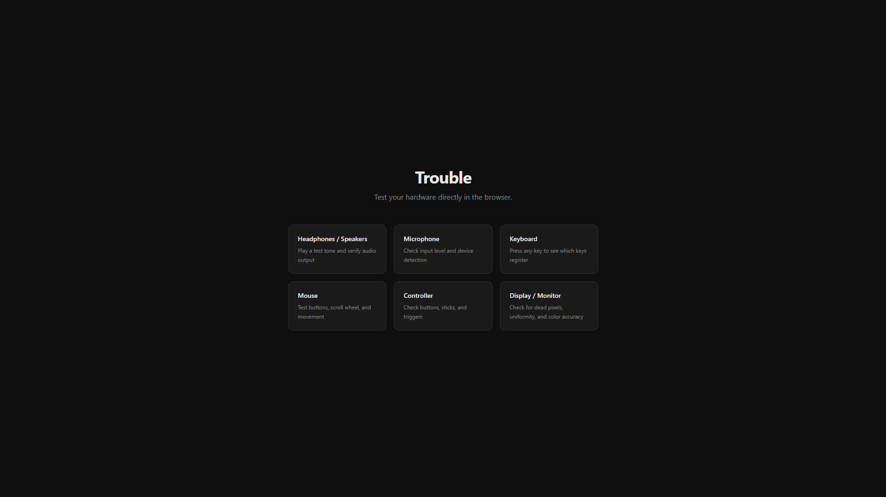
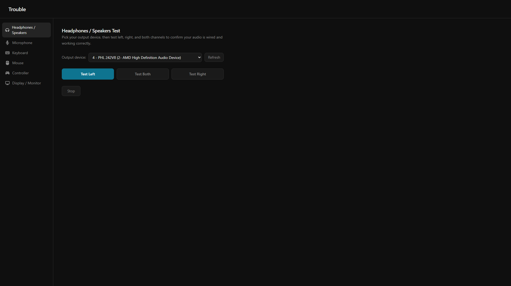
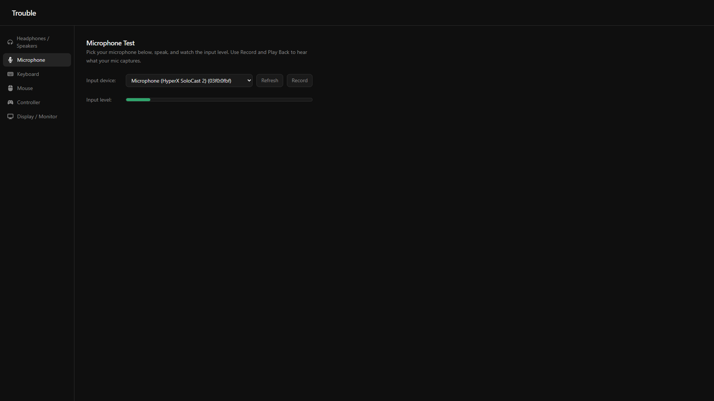
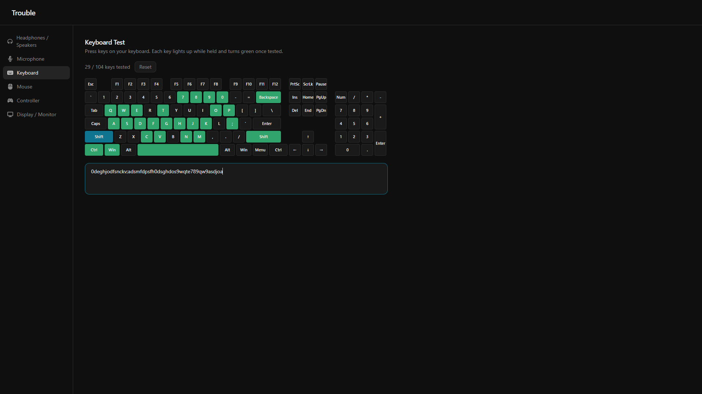
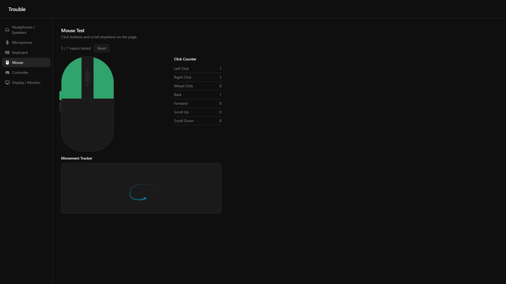
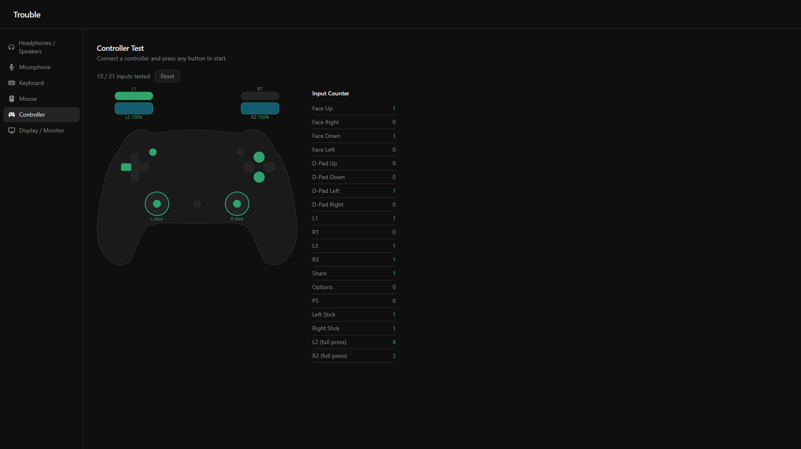

# Trouble Web

### A browser-based hardware tester built with React and TypeScript

[About](#about) • [Features](#features) • [Modules](#modules) • [Screenshots](#screenshots) • [Installation](#installation) • [Building](#building) • [Dependencies](#dependencies) • [License](#license)

---

## About

A web port of [Trouble](https://github.com/ckagias/hardware-doctor), the hardware testing app. Test your headphones, speakers, microphone, keyboard, and mouse directly in the browser. No install required, all processing runs locally via Web APIs.

If you find this useful, feel free to leave a star to help others find it!

---

## Features

- Left/right/both channel test tones for headphones and speakers
- Output device picker with refresh
- Live input level meter with peak-hold for microphone testing
- Record and play back to hear exactly what your mic captures
- Full keyboard layout with per-key tested/pressed tracking
- Mouse button click counter with scroll wheel and side button detection
- Gamepad input tester with SVG controller diagram, per-button press counters, and analog trigger meters
- Fullscreen display tests for dead pixels, backlight uniformity, color accuracy, gradient banding, and sharpness
- All processing handled locally in the browser via Web APIs

---

## Modules


| Module                | Description                                                                                                |
| --------------------- | ---------------------------------------------------------------------------------------------------------- |
| Headphones / Speakers | Pick an output device, play a tone to the left channel, right channel, or both                             |
| Microphone            | Pick an input device, watch the live input level, and record then play back to hear what your mic captures |
| Keyboard              | Press keys to see them light up; tracks which keys have been tested                                        |
| Mouse                 | Visual mouse diagram; counts clicks per button, scroll up/down events, and detects side buttons            |
| Controller            | SVG controller diagram; tracks all buttons, analog sticks, and trigger depth via the Gamepad API           |
| Display / Monitor     | Fullscreen tests for dead pixels, backlight uniformity, color accuracy, gradient banding, and sharpness    |


---

## Screenshots














---

## Installation

1. **Clone the repository**
  ```bash
   git clone https://github.com/ckagias/troubleshoot.git
   cd troubleshoot
  ```
2. **Install dependencies**
  ```bash
   npm install
  ```
3. **Run in development**
  ```bash
   npm run dev
  ```

---

## Building

```bash
npm run build
```

Produces a `dist/` folder ready to be served as a static site.

---

## Dependencies


| Package                                       | Purpose                           |
| --------------------------------------------- | --------------------------------- |
| [React](https://react.dev/)                   | UI component model                |
| [Vite](https://vite.dev/)                     | Build tool and dev server         |
| [TypeScript](https://www.typescriptlang.org/) | Type safety                       |
| Web Audio API                                 | Tone generation and audio routing  |
| MediaDevices API                              | Device enumeration and mic capture |
| AnalyserNode                                  | Real-time input level metering     |
| MediaRecorder API                             | Microphone record and playback     |


---

## License

This project is licensed under the [MIT License](LICENSE).